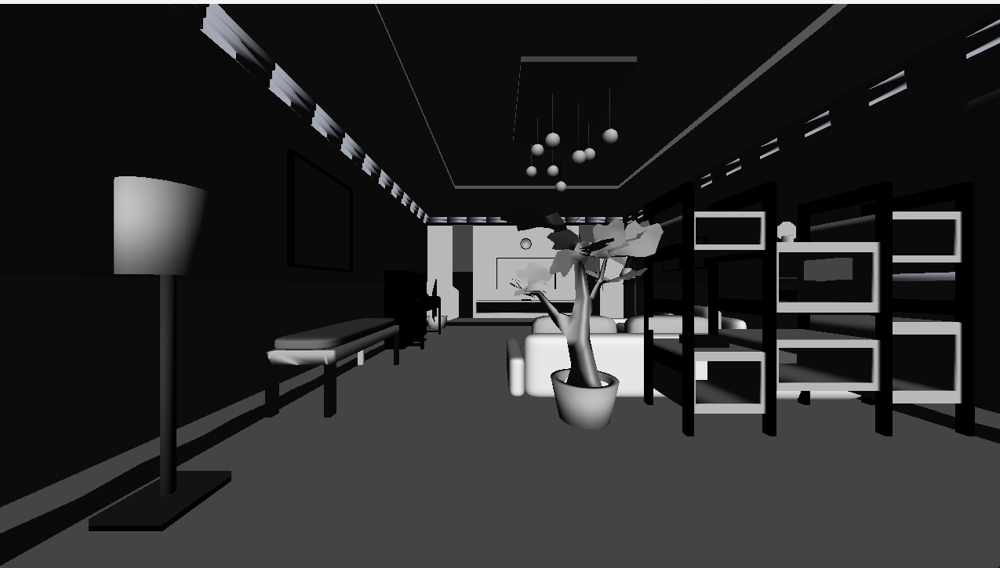

<h1 align="center"> CRender </h1>

A customised 3D rendering library designed for quick 3D renders without the setup pipeline required by OpenGL. Optimised for easy Python integration — in essence a 3-dimensional Pygame with more efficient shape drawing methods. Note that this does not open a window, you will have to use an extra library to do this, this is to allow more control over visuals, this will only output the frame data.

> **Note:** This package is currently in early development and may not be stable.

## Installation
```
pip install crender
```
---
# Usage

Note that this library is only currently compatible with NVIDIA GPUs as it uses CUDA for multithreaded rendering.

## Initialising

```python
import crender

engine = crender.Engine()
engine.init(SCREEN_WIDTH, SCREEN_HEIGHT)

## Only run this after adding all lights and whatnot, if you are adding shapes live, then run this after
engine.start_sim()
```

## Viewing
This library only exports framebuffers rather than the whole simulation, because im a bit too lazy to do it myself. The frames are in BGRA format, so you can use pygame or open-cv for rendering on the plane

```python
import pygame
import crender

engine.update()
buf = engine.get_framebuffer()
screen.fill((0, 0, 0))
surface = pygame.image.frombuffer(buf, (SCREEN_WIDTH, SCREEN_HEIGHT), "BGRA")
screen.blit(surface, (0, 0))
pygame.display.flip()
```

## Adding Shapes

Load a shape from an OBJ file and position it in the scene:
```python
sofa = engine.add_shape("sofa.obj", crender.create_point(0, 0, 0), width=1, height=1) # currently empty params
sofa.move_shape(10, 0, 0)
```

## Camera

Update the camera position and angle:
```python
from crender import create_point

position = create_point(1, 1, 1)
engine.update_camera(position, angleX=0, angleY=0, angleZ=0)
```

## Preview


## License
BSD 3-Clause "New" or "Revised" License. View LICENSE for more details